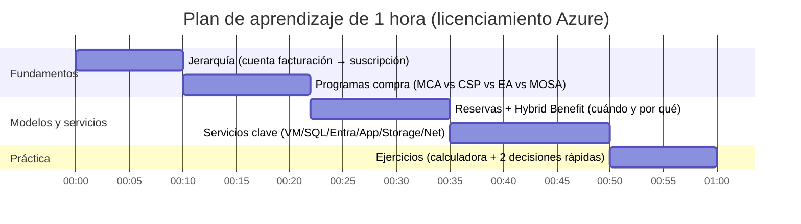

# Licenciamiento de Azure: modelos, servicios y plan de aprendizaje en 1 hora

## Resumen ejecutivo

El “licenciamiento” en Azure suele mezclar tres capas que conviene separar mentalmente para no confundirse:  
- **Programa/contrato de compra y facturación** (por ejemplo, **Microsoft Customer Agreement**, **CSP** o **EA**) que define *quién factura, cómo se organiza la factura, qué roles existen y cómo se administra*. citeturn13search2turn1search0turn1search5turn1search3  
- **Mecanismo de precio** (por ejemplo, **pago por uso**, **reservas/Reserved Instances**, **Azure Hybrid Benefit**) que define *si pagas por consumo o si te comprometes a 1–3 años para obtener descuentos y/o reutilizas licencias existentes*. citeturn1search2turn13search0turn13search1turn13search5  
- **Métrica de cobro/licencia por servicio** (por ejemplo, **por usuario/mes** en identidades, **por vCore/tiempo** en bases de datos, **por instancia/tiempo** en App Service, **por GB/mes + operaciones** en Storage, **por GB transferido** en redes). citeturn2search0turn2search9turn2search6turn2search23turn3search21  

En la práctica, la mayor parte del gasto de Azure es **por recurso/consumo** (IaaS y muchos PaaS), mientras que algunos componentes clave (especialmente identidad y seguridad) se licencian **por usuario** (por ejemplo, Microsoft Entra ID P1/P2). citeturn8search13turn2search12turn2search0  

Para optimizar costes, Azure tiene dos palancas especialmente relevantes y “financieramente potentes” cuando hay estabilidad de uso y/o licencias preexistentes:  
- **Reservas de Azure**: compromisos de **1 o 3 años** que pueden reducir el coste de recursos **hasta un 72%** respecto a pago por uso (según el caso). citeturn13search0turn13search3  
- **Azure Hybrid Benefit**: descuento que permite aplicar licencias on‑premises (por ejemplo, Windows Server y SQL Server) con **Software Assurance activa o suscripción** a cargas en Azure, con reglas específicas (por ejemplo, mínimos de cores). citeturn0search6turn13search17turn13search5  

El plan de aprendizaje de 1 hora al final está diseñado para que, en 60 minutos, puedas: (a) diferenciar **programa de compra** vs **métrica de cobro**, (b) mapear **servicios clave** a su modelo, y (c) practicar con la **calculadora de precios** y un par de ejercicios cortos de decisión (reservas vs AHB vs pago por uso). citeturn0search4turn13search0turn13search1turn2search0  

## Marco conceptual de licenciamiento en Azure

### Qué significa “suscripción” en Azure y por qué importa para licencias y costes

En Azure, una **suscripción** actúa como un límite (boundary) para **coste, cuotas, gobernanza, seguridad y controles de identidad** de los recursos contenidos en ella. Esto es crucial porque muchas decisiones de licenciamiento/optimización (p. ej., segmentar entornos, presupuestos o ámbitos de reservas) se implementan con la suscripción como unidad de gestión. citeturn7search2turn7search12turn5search5  

A su vez, una **cuenta de facturación** se crea al registrarte en Azure y es donde se gestionan **facturas, pagos y seguimiento de costes** (y puede haber varias cuentas si accedes por diferentes vías como EA o MCA). citeturn7search0turn13search14  

> Detalle no especificado por el usuario: tu organización puede tener una o múltiples suscripciones; el criterio óptimo depende de requisitos de aislamiento, gobernanza y cuotas (no se ha indicado sector, regulación ni estructura organizativa). citeturn7search2turn7search8  

### Tabla comparativa de modelos de licenciamiento y compra

La tabla siguiente compara **modelos/programas** que suelen aparecer cuando se habla de “licenciamiento de Azure”. Algunos son **programas de compra** (relación comercial), otros son **mecanismos de precio** (cómo se descuenta/paga), y otros son **métricas** (por usuario vs por recurso). Los agrupo en una sola tabla porque en conversaciones reales se mezclan, y esa mezcla es una fuente frecuente de errores.

| Modelo / concepto | Qué cubre (en términos de “licencia/precio”) | Cómo se factura / administra | Ventajas típicas | Limitaciones y condiciones típicas | Fuente oficial principal |
|---|---|---|---|---|---|
| **Pago por uso (Pay‑as‑you‑go)** | Consumo “on‑demand” de recursos (compute, PaaS, tráfico, etc.) sin compromiso previo. | Sin compromiso inicial; se asocia a una cuenta Azure y suscripciones. citeturn1search2turn7search0 | Arranque rápido; ideal para pruebas, incertidumbre o workloads variables. citeturn1search2 | Puede ser más caro si el uso es constante y predecible (frente a reservas/beneficios). citeturn13search0 | citeturn1search2turn13search0 |
| **Suscripción/SKU (ej. por usuario en identidad)** | Derechos de uso por **usuario/mes** (p. ej., Microsoft Entra ID P1/P2). | Suele ser por usuario/mes; en el pricing público de Entra se indica pago anual con compromiso anual (según oferta). citeturn2search0 | Predecible para identidad/seguridad; se alinea con “personas” y no con recursos. citeturn2search0turn2search12 | Requiere gobernar asignaciones de licencias; no reduce consumo de recursos, sino capacidades/funcionalidades. citeturn3search16 | citeturn2search0turn2search12 |
| **Azure Reservations (incl. Reserved VM Instances)** | Descuento por comprometerte **1 o 3 años** para ciertos productos; es un **descuento de facturación**, no cambia el “runtime”. citeturn13search0 | Compra de reserva; el descuento se aplica automáticamente a recursos que “encajan” (matching). citeturn13search0turn0search5 | Ahorro de hasta **72%** vs pago por uso en determinados casos. citeturn13search0turn13search3 | Requiere previsibilidad; hay que revisar cobertura/matching y alcance; permisos de gestión de reserva son independientes de permisos de suscripción (dato relevante en organizaciones). citeturn13search4turn13search0 | citeturn13search0turn13search4turn13search3 |
| **Azure Hybrid Benefit (AHB)** | Descuento por reutilizar licencias on‑premises (Windows Server/SQL Server) con **Software Assurance o suscripción** en Azure. citeturn0search6turn13search5 | Se habilita según servicio; para Windows VMs hay requisitos como mínimo de cores licenciados por VM. citeturn13search17 | Reduce costes de workloads “lift‑and‑shift” y parte de PaaS (p. ej., Azure SQL con AHB). citeturn13search13turn4search6 | Elegibilidad sujeta a reglas (por ejemplo, mínimo 8 cores por VM para Windows Server AHB). citeturn13search17 | citeturn13search5turn13search17turn13search13 |
| **CSP (Cloud Solution Provider) / Azure plan** | **Programa de compra** a través de partner; Azure se vende bajo un **Azure plan** dentro del marco del partner. citeturn1search0turn1search12 | El partner gestiona (según modalidad) el tenant/plan/subscripciones y facturación en Partner Center. citeturn1search8turn1search16 | Externaliza gestión/soporte; consolidación de compras cloud; útil para pymes sin equipo FinOps. citeturn1search0 | Dependencia del partner (gobernanza y operación); algunas capacidades de gestión centralizada pueden tener limitaciones según modelo (ej. ciertas experiencias de AHB centralizado para SQL no están disponibles cuando un partner CSP gestiona Azure). citeturn0search26turn1search0 | citeturn1search0turn1search12turn0search26 |
| **EA (Enterprise Agreement)** | **Programa de compra** orientado a organizaciones grandes (contrato empresarial). | Administración en Azure portal (EA portal retirado 15‑feb‑2024). citeturn1search5turn1search1 | Suele aportar gobierno empresarial y procesos maduros de facturación/chargeback; acceso a “price sheet” y reporting EA. citeturn1search17turn1search5 | Complejidad administrativa; requiere roles/procesos EA; transición a otras modalidades implica cambios de estructura de facturación. citeturn1search21turn13search6 | citeturn1search5turn1search17turn1search21 |
| **Microsoft Customer Agreement (MCA)** | **Contratación directa** moderna; define jerarquía de facturación (billing profile, invoice section) y roles. citeturn0search7turn7search13 | Una cuenta de facturación MCA contiene perfiles de facturación e “invoice sections” para organizar facturas. citeturn0search7turn13search10 | No indica mínimos de compra y ofrece flexibilidad de facturación (según mensaje comercial). citeturn1search34 | Cambia la forma de organizar y operar respecto a EA; algunas transiciones pueden ser irreversibles (según documentación de traspaso de facturación). citeturn13search6turn1search21 | citeturn13search2turn0search7turn1search34turn13search6 |
| **Microsoft Online Subscription Agreement (MOSA)** | Acuerdo legal para compras de suscripción online; se compone de términos + Online Services Terms/SLAs/Offer details. citeturn1search3 | Históricamente asociado a compra online directa; Microsoft describe diferencias al pasar de MOSA a MCA. citeturn1search7 | Sencillez para compras online individuales/pequeñas. citeturn1search3 | Microsoft indica que comprar bajo MCA difiere de comprar online bajo MOSA. citeturn1search7 | citeturn1search3turn1search7 |
| **“Online Services Terms” y “Microsoft Online Services” (marco legal)** | Términos de uso de servicios online (histórico OST) incorporados en el marco actual de **Product Terms**. citeturn4search0 | Product Terms actúa como repositorio unificado e incorpora por referencia términos aplicables. citeturn4search0turn4search1 | Centraliza el “derecho de uso” y evita depender de documentos obsoletos. citeturn4search0 | Requiere consultar la versión vigente; actualizaciones aplican según el acuerdo del cliente. citeturn4search0 | citeturn4search0turn4search1 |
| **Licenciamiento por usuario** | Capacidades asociadas a identidades (ej. Entra P1/P2) y/o seguridad. citeturn2search0turn2search12 | Cobro por usuario/mes (a veces con compromiso anual según oferta pública). citeturn2search0 | Se alinea con “personas” y controles; fácil de presupuestar. citeturn2search0 | No sustituye el coste de recursos Azure; es complementario. *(No especificado: tu mix de licencias M365/EMS puede incluir Entra P1/P2.)* citeturn2search12 | citeturn2search0turn2search12 |
| **Licenciamiento por recurso/consumo** | Recursos (VMs, App Service plan, DB, Storage, red) según métricas de servicio. citeturn2search6turn2search23turn2search9turn3search21 | Medición por hora/segundo/GB/operación según servicio. citeturn2search23turn3search21turn2search9 | Ajustable con escalado y optimización (reservas, autoscale). citeturn13search0turn6search12 | Requiere FinOps/gobernanza para evitar derroche (tags, presupuestos, recomendaciones). citeturn5search4turn5search1turn5search3 | citeturn5search4turn6search12turn13search0 |

**Nota de alcance (no especificado por el usuario)**: no se ha indicado si buscas licenciamiento para **Azure Government**, educación, ni si hay contratos marco adicionales (p. ej., anexos de privacidad sectoriales). El análisis se centra en el **comercial general**. citeturn13search14turn4search0  

## Licenciamiento por servicios clave y consideraciones PaaS vs IaaS

### PaaS vs IaaS como “marco de licenciamiento”

Una distinción útil es que en **IaaS** tú gestionas más capas (VMs, sistema operativo, aplicaciones), mientras que en **PaaS** despliegas aplicaciones sin gestionar VMs ni sistemas operativos; el proveedor abstrae infraestructura. citeturn8search13turn8search16turn8search3  

Esto afecta al licenciamiento así:  
- En **IaaS (VMs)** aparece con frecuencia el dilema **“licencia incluida” vs “traer licencia”** mediante beneficios como **Azure Hybrid Benefit** (cuando aplica). citeturn13search17turn0search6  
- En **PaaS (Azure SQL, App Service, etc.)** el “licenciamiento” suele estar embebido en el precio del servicio, aunque puede haber descuentos por licencias existentes (p. ej., AHB para Azure SQL). citeturn13search13turn2search6  

### Tabla de mapeo: servicios clave → modelo de cobro/licenciamiento y notas

| Servicio | Modelo “dominante” de cobro/licencia | Unidad típica de cobro (simplificada) | Reservas / AHB / otras palancas | Notas y riesgos comunes |
|---|---|---|---|---|
| **Virtual Machines (VMs)** | Por recurso/consumo (IaaS). citeturn8search13 | Compute por tiempo + costes separados de storage/red (detalle exacto depende de SKU y servicio; **no especificado** aquí). | **Reservas** pueden dar descuentos vs pago por uso; se sigue pagando storage y red. citeturn13search0turn13search15 **AHB** para Windows Server tiene requisitos (mínimo 8 cores por VM). citeturn13search17 | Riesgo de “VM encendida 24/7” sin necesidad; se mitiga con escalado/automatización. citeturn6search12turn5search3 |
| **Azure SQL** (Database/MI, etc.) | PaaS por consumo; modelos de compra **vCore** y **DTU**. citeturn2search9turn2search17 | En vCore: compute + storage escalables (provisionado o serverless). citeturn2search9 | **AHB para Azure SQL** permite asignar licencias SQL Server con SA y ahorrar (Microsoft menciona “30% o más” en SQL Database/MI). citeturn4search6turn13search13 Reservas: el pricing reservado está asociado al modelo vCore (reservas solo disponibles para vCore). citeturn2search13 | Evitar confundir “SQL en VM” (IaaS) con “Azure SQL” (PaaS). El tipo de requisito/licencia cambia. *(Detalle de tu caso: no especificado).* citeturn8search13turn2search9 |
| **Azure AD / Entra ID** (Free / P1 / P2; “Basic” solicitado) | **Por usuario** (identidad/capacidades). citeturn2search12turn2search0 | Precio de referencia público: P1 ~ **$6 usuario/mes** (pago anual) y P2 ~ **$9 usuario/mes** (pago anual), según página comercial. citeturn2search0 | Palancas: asignación selectiva de licencias y revisión de requisitos (ej. roles). Por ejemplo, **roles integrados** son gratis, pero **roles personalizados** requieren P1 para cada usuario con rol personalizado. citeturn3search5 | **“Basic”**: en documentación actual de licenciamiento de Entra la segmentación principal es Free/P1/P2; el estado del SKU “Basic” como plan general **no queda especificado** en las páginas oficiales consultadas para 2025–2026. citeturn2search12turn3search9 |
| **App Service** | PaaS; el **App Service plan** define recursos y el “SKU” de hosting (tiers). citeturn2search6turn8search11 | Se cobra por el plan/instancias subyacentes (excepto Free; en dedicated tiers cada instancia del plan se cobra igual independientemente de cuántas apps corran). citeturn2search22turn6search20 | Optimización: dimensionar tiers, escalar (manual/autoscale) y consolidar apps en planes; en escenarios Dev/Test existen tarifas específicas para suscriptores de Visual Studio con ahorro indicado (hasta 55%). citeturn6search13turn2search2 | “Todo en el plan escala junto”: si metes apps heterogéneas en el mismo plan, puedes sobredimensionar por una sola app. citeturn6search20 |
| **Storage (Blob)** | PaaS por consumo. citeturn8search13 | **GB/mes** de datos + operaciones; además hay consideraciones por tier (hot/cool/cold/archive) y retrieval si rehidratas desde archive. citeturn2search23turn2search19turn2search11 | Palancas: elegir tier adecuado; gobernar lifecycle; estimar costes con calculadora. citeturn0search8turn2search19 | Riesgo: costes “sorpresa” por retrieval/operaciones si no se diseña el acceso/rehidratación. citeturn2search11turn2search19 |
| **Networking (VNet, peering, egress/bandwidth, VPN, etc.)** | Por consumo (tráfico/servicios de red). citeturn3search21turn3search2 | VNet base se describe como “gratis” en páginas regionales, pero el **peering** y transferencias se cobran; egress suele tener tarifas y el inbound a menudo es gratuito (según producto/tabla). citeturn3search6turn3search2turn3search3 | Palancas: arquitectura (minimizar tráfico inter‑región), elegir servicios y regiones; revisar precios de ancho de banda por origen/destino. citeturn3search3turn3search21 | Riesgo: entre regiones, el outbound se cobra (“data transfer between two regions” sí se cobra) y puede crecer rápido. citeturn3search3turn3search28 |

## Diferencias entre modelos de compra y contratos

Esta sección responde a “qué cambia” al comprar **CSP vs EA vs Pay‑as‑you‑go vs MCA**, y cómo se relaciona con licenciamiento/gestión.

### CSP: Azure mediante partner (Azure plan)

En CSP, Azure se materializa como un **Azure plan** con suscripciones, normalmente alojado bajo el acuerdo del partner (**Microsoft Partner Agreement**) y gestionado por el partner (con variaciones según el modelo operativo). citeturn1search0turn1search8turn1search16  

Microsoft describe el Azure plan en el “new commerce experience” como acceso a Azure a tarifas pay‑as‑you‑go para clientes bajo **Microsoft Customer Agreement** (en el contexto de Partner Center). citeturn1search12turn1search22  

Implicación práctica: en CSP, además de **tus** decisiones (reservas, escalado, tagging), existe un plano de **gobernanza y facturación** que depende de cómo el partner organice la operación y la factura (por ejemplo, conciliación e invoice a calendario mensual en Azure plan billing). citeturn1search16turn5search4  

### EA: contrato empresarial y administración en Azure portal

EA se orienta a organizaciones grandes; la administración se realiza en Azure portal y el antiguo **EA portal** quedó retirado (read‑only). citeturn1search5turn1search1  

Operativamente, EA suele venir acompañado de prácticas de reporting (revisión de factura EA, price sheet, descargas CSV) y roles específicos. citeturn1search17turn1search9  

### Directo (Pay‑as‑you‑go) y MCA: la compra moderna directa

- “Pago por uso” es un **modo de consumo** (sin compromiso previo) y también una narrativa de “cómo empiezas” con Azure (incluso vía cuenta gratuita o pay‑as‑you‑go). citeturn1search2turn1search33  
- “MCA” es un **marco contractual** y de **estructura de facturación**: cuenta de facturación → perfiles de facturación → secciones de factura (invoice sections). citeturn0search7turn13search10  

Microsoft también posiciona MCA como un acuerdo “sin mínimos de compra” (mensaje comercial), y hay documentación específica para administrar facturación y suscripciones bajo MCA. citeturn1search34turn13search2  

### MOSA y “Microsoft Online Services”

El **Microsoft Online Subscription Agreement (MOSA)** es un acuerdo aplicable a compras de suscripción online; además se apoya en otros términos (Online Services Terms, SLAs, Offer Details) según la propia página legal. citeturn1search3  

Para el marco “Online Services Terms”, Microsoft indica que los términos que antes estaban en **Online Services Terms** se movieron a **Product Terms** y ya no existen como documento independiente. Esto es relevante para cumplimiento: cuando alguien dice “Online Services Terms”, en la práctica moderna suele significar “busca en Product Terms”. citeturn4search0turn4search1  

image_group{"layout":"carousel","aspect_ratio":"16:9","query":["Microsoft Customer Agreement billing hierarchy diagram Azure portal","Azure Enterprise Agreement billing hierarchy diagram Cost Management + Billing","Azure CSP Azure plan hierarchy diagram Microsoft Partner Agreement"],"num_per_query":1}

## Ejemplos numéricos y escenarios típicos

Los números siguientes son **ilustrativos** y usan ejemplos publicados por Microsoft o precios de referencia públicos. Faltan datos críticos no especificados por ti (región exacta, moneda, impuestos, descuentos negociados, SKUs exactos, horas reales de uso y patrón de escalado). La recomendación práctica es siempre contrastar con la **Calculadora de precios** (y, si aplican, tus precios negociados al iniciar sesión). citeturn0search16turn0search8turn3search20  

### Escenario de pequeña empresa: identidad por usuario + consumo moderado

Supongamos una pyme con 25 usuarios que necesita funcionalidades que encajan con Entra P1. En pricing público, **Entra ID P1** aparece a **$6 usuario/mes** con pago anual (compromiso anual). Un cálculo simple de “run‑rate” mensual sería 25 × 6 = **$150/mes** (coste anual estimado: $1.800), sin impuestos y asumiendo que el precio público aplica. citeturn2search0  

En red, si esa pyme tiene 500 GB/mes de salida a Internet desde Europa, la tabla de ancho de banda (ejemplo en página regional en español) indica: **primeros 100 GB/mes gratis** y después, para “Norteamérica o Europa a cualquier destino”, un tramo a **$0,04/GB** (según tabla). Una aproximación simple: (500‑100)×0,04 = **$16/mes** (moneda y aplicabilidad exacta dependen de oferta/contrato; aquí se usa el precio publicado). citeturn3search21  

**Decisión de licenciamiento típica**: separar mentalmente (a) coste fijo de identidad por usuario, (b) coste variable de recursos y tráfico; y presupuestar ambos por separado. citeturn2search0turn3search21  

### Escenario startup: maximizar flexibilidad y evitar compromisos prematuros

Una startup suele priorizar:  
- “pago por uso” para absorber cambios (sin compromiso), citeturn1search2  
- PaaS gestionado cuando reduzca esfuerzo operativo (por ejemplo, App Service “sin preocuparte por la infraestructura subyacente”), citeturn8search3turn8search13  
- y control de costes con presupuestos/alertas y tagging desde el primer día. citeturn5search1turn5search4turn7search8  

Numéricamente, el valor clave aquí no es un “precio exacto” (no especificado), sino el **mecanismo**: si una carga se vuelve estable, entonces tiene sentido reevaluar **reservas** para parte del consumo. citeturn13search0turn5search3  

### Escenario de migración on‑premises con licencias existentes: AHB + reservas

Este es el caso donde el “licenciamiento” se vuelve más estratégico.

**1) Reutilizar Windows Server con Azure Hybrid Benefit**  
Microsoft documenta que para usar AHB en Windows Server VMs necesitas **mínimo 8 licencias de core por VM**, incluso si ejecutas una VM de 4 cores. citeturn13search17  

**2) Añadir reservas para consumo estable**  
Microsoft publica ejemplos concretos (ojo: son ejemplos con región/SKU específicos y fecha de referencia):  
- Ejemplo de ahorro del **72%**: una VM M32ts para SUSE Linux Enterprise en “Oeste de EE. UU. 2”, comparando ~$1.976,11/mes (pay‑as‑you‑go) vs ~$552,85/mes (reserva 3 años), con precios a fecha 22‑feb‑2022 y “precios sujetos a cambio”. citeturn13search3  
- Ejemplo de hasta **80%** combinando **AHB para Windows Server + reserva 3 años**: comparativa del coste de una VM D8s v4 Windows en “Oeste de EE. UU. 2” ~$548,96/mes pay‑as‑you‑go vs ~$105,39/mes con reserva + AHB (sin incluir el coste de Software Assurance). citeturn13search3  

**Interpretación práctica**:  
- Si tu migración es “lift‑and‑shift” y ya tienes licencias cubiertas (con SA/suscripción), AHB puede recortar una parte importante del componente de software. citeturn13search5turn13search17  
- Si, tras migrar, el uso se estabiliza, reservas te permiten convertir parte del gasto variable en compromiso a 1‑3 años con descuento. citeturn13search0turn13search3  

**3) En Azure SQL (PaaS)**  
Para Azure SQL Database / Managed Instance, Microsoft indica que AHB puede permitir ahorrar **“30% o más”** usando licencias SQL Server con SA en Azure SQL. citeturn4search6turn13search13  

> Detalle no especificado que cambia totalmente el cálculo: cuántos cores (y edición) tienes licenciados on‑premises, si tienes Software Assurance activa, y si el destino es **SQL en VM (IaaS)** o **Azure SQL (PaaS)**. citeturn0search6turn2search9turn13search13  

## Cumplimiento, facturación y optimización de costes

### Cumplimiento y términos de uso

A nivel de cumplimiento, lo más importante es saber **dónde** se definen los términos de uso. Microsoft indica que los términos que estaba en **Online Services Terms** se movieron a **Product Terms** y ya no existen como documento independiente, por lo que en auditorías/interpretaciones el punto de referencia “vivo” es Product Terms. citeturn4search0turn4search1  

Para funcionalidades en **preview**, existe documentación de **Preview Supplemental Terms** (términos suplementarios) con fecha de actualización (por ejemplo, “Last Updated: November 2025”). citeturn4search3turn4search7  

> Detalle no especificado: requisitos regulatorios (p. ej., sector sanitario/financiero), región de datos o compromisos contractuales adicionales. El enfoque aquí es el marco legal general. citeturn4search7turn4search0  

### Facturación y control: roles, scopes, y organización de costes

En MCA, la jerarquía de facturación incluye **billing profiles** (facturas separadas) e **invoice sections** (segmentos dentro de la factura), y hay roles específicos para administrar ese entorno. citeturn0search7turn7search13turn13search10  

Para controlar costes de forma operativa, Microsoft recomienda estructurar recursos con jerarquías (management groups, suscripciones) y complementar con **naming + tags** para atribución de costes. citeturn7search5turn7search8turn5search4  

Dos mecanismos de etiquetado relevantes:  
- **Azure tags** sobre recursos: permiten agrupar y asignar costes; se pueden reforzar con **Azure Policy** para exigir tags conforme a una estrategia. citeturn5search4turn7search15  
- **Billing tags** en entidades de facturación MCA (billing profiles e invoice sections): útiles cuando deseas organización adicional a nivel factura. citeturn5search2  

### Optimización: reservas, escalado y recomendaciones

**Reservas**: se describen como descuento de facturación que no afecta al runtime; pueden reducir costes hasta 72%. citeturn13search0turn0search5 Además, tras comprar una reserva de VM, sigues pagando storage y red a tarifas normales (dato clave para no “sobreestimar” ahorro). citeturn13search15  

**Escalado/Autoscale**: autoscale puede reducir costes cuando la carga baja (reduce número de recursos) y ayuda a evitar sobreaprovisionamiento. citeturn6search12turn6search0 En App Service, el escalado del plan afecta a todas las apps del plan; esto es una consideración de diseño para costes. citeturn6search20turn2search22  

**Recomendaciones**: Azure Advisor ofrece recomendaciones de coste identificando recursos infrautilizados/idle y acciones de optimización. citeturn5search3turn5search20  

**Presupuestos y alertas**: los budget alerts notifican cuando el gasto alcanza umbrales definidos; son una herramienta de “guardarraíl” especialmente útil en pay‑as‑you‑go y en entornos con varios equipos. citeturn5search1turn5search11  

image_group{"layout":"carousel","aspect_ratio":"16:9","query":["Azure Reservations discount diagram cost management","Azure Hybrid Benefit Windows Server licensing diagram","Azure Cost Management tags cost allocation diagram"],"num_per_query":1}

## Recursos oficiales prioritarios en español e inglés

Selección curada y priorizada para licenciamiento y costes (primero lo más “base” para entender y calcular):

**Estimación y precios**
- Calculadora de precios (ES). citeturn0search4  
- Pricing calculator (EN). citeturn0search0  
- Guía para usar la calculadora de precios (ES). citeturn0search16  
- Guide to use the pricing calculator (EN). citeturn0search8  

**Reservas y beneficios híbridos**
- ¿Qué es Azure Reservations? (ES). citeturn13search0  
- What are Azure Reservations? (EN). citeturn0search5  
- Reserved VM Instances (ejemplos numéricos y notas) (ES). citeturn13search3  
- Documentación de Ventaja híbrida de Azure (ES). citeturn13search1  
- Azure Hybrid Benefit documentation (EN). citeturn0search2  
- AHB para Windows VMs (requisitos de cores) (ES/EN según versión). citeturn13search17turn4search10  
- AHB para Azure SQL (ES/EN). citeturn13search13turn4search6  

**Contratos, términos y facturación**
- Documentación de Contrato de cliente de Microsoft (MCA) (ES). citeturn13search2  
- Microsoft Customer Agreement billing overview (EN). citeturn0search7  
- Microsoft Online Subscription Agreement (MOSA) (EN). citeturn1search3  
- Artículo “From MOSA to Microsoft Customer Agreement” (EN). citeturn1search7  
- Product Terms (incluye términos que antes estaban en Online Services Terms) (EN). citeturn4search0turn4search1  

**Modelos de compra (CSP/EA)**
- Diseño de facturación para CSP (Cloud Adoption Framework) (EN). citeturn1search0  
- Azure plan (Partner Center) overview (EN). citeturn1search12  
- Get started with your EA billing account (EN). citeturn1search5  
- EA administration on Azure portal (EN). citeturn1search9  

**Cost Management (tagging, presupuestos, recomendaciones)**
- Introducción a cost allocation y tags (EN). citeturn5search4  
- Use tags to organize resources (EN). citeturn5search0  
- Presupuestos (tutorial ES). citeturn5search22  
- Cost recommendations (Advisor) (EN). citeturn5search3  

## Plan de aprendizaje de 1 hora

**Objetivo global (60 min)**: salir con un “mapa mental” que te permita (1) identificar el **programa de compra** (MCA/CSP/EA/MOSA), (2) asignar **cada servicio** a su **métrica de coste/licencia**, y (3) aplicar **dos palancas** (reservas y AHB) con criterio básico, usando la calculadora para verificar. citeturn13search0turn13search5turn0search16turn1search0turn1search5  

### Estructura por bloques con lecturas y ejercicios

| Tiempo | Objetivo de aprendizaje | Lecturas prioritarias | Ejercicio práctico (rápido) |
|---|---|---|---|
| 0–10 min | Entender “capas”: cuenta de facturación vs suscripción vs recurso; por qué la suscripción es un boundary de coste/gobernanza. citeturn7search2 | MCA/billing overview (ES o EN según prefieras). citeturn13search2turn0search7 | Escribe tu propio mapa: **Billing account → Suscripciones → Resource groups → Recursos**. Marca dónde crees que se decide: (a) quién paga, (b) quién despliega, (c) quién etiqueta. citeturn7search12turn5search4 |
| 10–22 min | Diferenciar programas de compra: **CSP vs EA vs directo (MCA/PayG) vs MOSA** y qué cambia administrativamente. citeturn1search0turn1search5turn1search7 | CSP billing design (CAF). citeturn1search0  EA get started (EN). citeturn1search5  MOSA + MOSA→MCA (EN). citeturn1search3turn1search7 | Elige tu “canal” hipotético (no especificado por ti): ¿comprarías directo o CSP? Escribe 3 razones operativas (roles, factura, soporte) y 2 riesgos. citeturn1search0turn7search13 |
| 22–35 min | Comprender **Reservas** y **Azure Hybrid Benefit** como palancas (cuándo aplican, qué requisitos clave). citeturn13search0turn13search5turn13search17 | Reservas (ES). citeturn13search0  AHB doc (ES). citeturn13search1turn13search17  Ejemplos numéricos de Reserved VM Instances (ES). citeturn13search3 | Identifica 2 workloads: uno “estable” y otro “variable”. Decide: estable → candidato a reserva; variable → pay‑as‑you‑go + autoscale. Justifícalo en 4 líneas. citeturn13search0turn6search12 |
| 35–50 min | Mapear servicios clave a su modelo: VMs (IaaS), Azure SQL (PaaS), Entra ID (usuario), App Service (plan), Storage (GB+ops), Networking (egress/peering). citeturn8search13turn2search9turn2search0turn2search22turn3search3 | PaaS vs IaaS (responsabilidad compartida). citeturn8search13  Azure SQL purchasing models (EN). citeturn2search9  Entra licensing/pricing (ES/EN). citeturn3search9turn2search0  App Service plan overview. citeturn2search6 | Caso relámpago: “Quiero SSO + acceso condicional + app web + base de datos + backups”. Escribe qué parte es por usuario y cuál por recurso (y por qué). citeturn2search0turn8search11turn2search23 |
| 50–60 min | Practicar con calculadora y controles FinOps mínimos (tags, presupuestos, Advisor). citeturn0search16turn5search4turn5search3turn5search1 | Calculadora (ES) + guía (ES). citeturn0search4turn0search16  Tags/cost allocation (EN). citeturn5search4  Budgets/alerts (EN o ES). citeturn5search1turn5search22  Advisor costes (EN). citeturn5search3 | 1) Entra en la calculadora y monta un escenario mínimo (VM o App Service + Storage). 2) Apunta 3 drivers de coste. 3) Define 3 tags (owner, env, costCenter) y un presupuesto mensual. citeturn0search16turn5search4turn5search1 |

**Criterio de éxito al final de la hora** (autoevaluación): si puedes explicar en voz alta (1 minuto) la diferencia entre **“comprar por CSP”** y **“aplicar una reserva”** y (otro minuto) la diferencia entre **“licencia por usuario (Entra)”** y **“coste por recurso (App Service/VM/Storage)”**, has adquirido el núcleo práctico. citeturn1search0turn13search0turn2search0turn2search22
